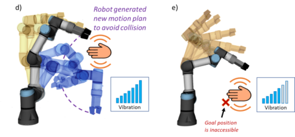

## Improved Mutual Understanding for Human-Robot Collaboration 
We propose a novel approach to communicating the robot’s intentions to a human worker. The improvement to the collaboration is presented by introducing haptic feedback devices, whose task is to notify the human worker about the currently planned robot’s trajectory and changes in its status.

[](https://www.youtube.com/watch?v=pzwWaD9q2bo)


## Related publications

*   [Improved Mutual Understanding for Human-Robot Collaboration: Combining Human-Aware Motion Planning with Haptic Feedback Devices for Communicating Planned Trajectory](https://www.mdpi.com/1424-8220/21/11/3673)
*   [Intuitive Spatial Tactile Feedback for Better Awareness about Robot Trajectory during Human–Robot Collaboration](https://doi.org/10.3390/s21175748)

```
@article{s21175748,
author = {Grushko, Stefan and Vysocky, Ales and Heczko, Dominik and Bobovský, Zdenko},
year = {2021},
month = {08},
pages = {},
title = {Intuitive Spatial Tactile Feedback for Better Awareness about Robot Trajectory during Human-Robot Collaboration},
volume = {21},
journal = {Sensors (Basel, Switzerland)},
doi = {10.3390/s21175748}
}
```
```
@article{s21113673,
author = {Grushko, Stefan and Vysocky, Ales and Oščádal, Petr and Vocetka, Michal and Novak, Petr and Bobovský, Zdenko},
year = {2021},
month = {05},
pages = {3673},
title = {Improved Mutual Understanding for Human-Robot Collaboration: Combining Human-Aware Motion Planning with Haptic Feedback Devices for Communicating Planned Trajectory},
volume = {21},
journal = {Sensors},
doi = {10.3390/s21113673}
}
```

 

The proposed system is based on the concept of a shared collaborative workspace where the robot may adapt its movement to avoid collision with human workers. The workspace is monitored by multiple RGB-D sensors, and data provided by these sensors allow to construct a map of robot’s surroundings and obstacles. At each step of the task execution, the robot creates a collision-free motion plan according to the currently available free space. If during the execution of the planned movement there is a change in the environment (for example, existing obstacles change their location) and the movement can no longer be completed due to possible collisions with obstacles, the robot can create a new motion plan. <br/>
 <br/>
The improvement to the collaboration is presented by introducing haptic feedback devices (Human-Machine Interfaces, HMIs), whose task is to reliably notify the human worker about the currently planned robot’s trajectory and changes in its status. A wearable device is used to improve the operator’s awareness during the human-robot collaborative assembly task through vibrotactile feedback. The human worker is equipped with two haptic feedback devices fastened at each hand. These feedback devices provide continuous vibration alert (hereinafter “distance notification”) to the user about the proximity to the currently planned trajectory of the robot. The future trajectory segment is defined as the part of the feasible trajectory that yet has not been executed.<br/>
 <br/>
The closer the worker's hand (equipped with HMI) approaches the future segment of the trajectory, the stronger is the vibration provided by the device. The length of the vector between the nearest points of HMI and the robot body searched among all timesteps of the future trajectory is considered to be the distance, which is used to calculate the vibration intensity. There is also an upper limit of the distance at which HMIs provide feedback – reaction distance dr (Figure 34c). This ensures that the worker receives an alert only if his/her current actions may interfere with the robot trajectory.<br/>

 <br/>
When a person, despite a warning, interferes with the currently planned trajectory, the robot attempts to find a new feasible path to the goal position and continue the activity. Every time a new trajectory is planned as a result of environment change, both feedback devices use strong vibration notification to draw the attention of the human worker and to indicate that the robot has detected an environment change and has replanned its movement (Figure 35a). If no feasible path to the target has been found, both feedback devices also provide a strong vibration alert, but this alert will last until the robot is able to continue its activity (movement to the goal). 

